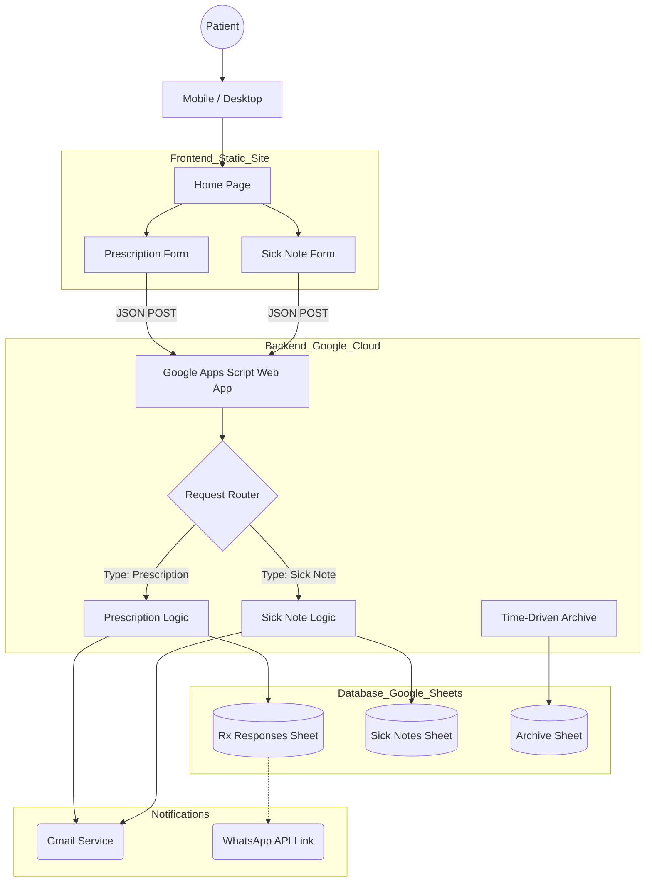

# Example Medical Practice - Digital Transformation Proposal

## 1. Executive Summary

We propose a comprehensive digital transformation of the Example Medical Practice's online presence. This solution replaces the legacy system with a modern, responsive, and secure web platform designed to streamline patient requests, reduce administrative overhead, and ensure GDPR compliance.

By leveraging a serverless architecture (Google Apps Script) combined with high-performance static hosting, we deliver a cost-effective, zero-maintenance solution that integrates directly with your existing workflows (Google Sheets).

## 2. Solution Overview

### The Product
A 14-page bespoke website featuring interactive patient portals for prescription ordering and sick note certification.

### Value Proposition
*   **Efficiency:** Automates the sorting and processing of hundreds of weekly requests.
*   **Accessibility:** Fully responsive design ensures patients can access services from any device (Mobile, Tablet, Desktop).
*   **Control:** Ownership of your data (Google Sheets) rather than relying on third-party SaaS silos.
*   **Cost:** "One-time build" architecture with negligible ongoing hosting costs.

## 3. Key Features

### 💊 Smart Prescription Ordering
*   **Interactive Form:** Users can add multiple medications to a "digital cart" before submitting.
*   **Validation:** Built-in checks ensure all required patient details (DOB, Phone, Pharmacy) are captured.
*   **Intelligent Routing:** Submissions are automatically routed to a central "Form Responses" sheet, timestamped and status-tracked.
*   **Notification System:** Automated email confirmations to patients and WhatsApp integration for "Ready for Collection" alerts.

### 📝 Digital Sick Notes
*   **E-Signature:** Integrated signature pad allows patients to sign requests digitally on their phone.
*   **Secure Workflow:** Requests are routed to a dedicated "Sick Notes" secure sheet.
*   **Triage:** Auto-response emails inform patients of the 48-hour processing window and payment details.

### 🛡️ Compliance & Security
*   **Zero Tolerance & Confidentiality:** Dedicated pages clearly outlining practice policies.
*   **Data Protection:** No patient data is stored on the web server; it flows directly to your secure, private Google Drive environment.
*   **No-CORS Security:** Frontend inputs are sanitized, and the backend accepts only specific JSON payloads.

## 4. Technical Specifications & Statistics

| Metric | Value | Description |
| :--- | :--- | :--- |
| **Total Pages** | 14 | Including specific portals for Appointments, Prescriptions, and Policies. |
| **Frontend Code** | ~3,500 Lines | Semantic HTML5 for accessibility and SEO. |
| **Styling (CSS)** | 855 Lines | Custom "Example Town Deep Green" theme with fluid responsiveness. |
| **Backend Logic** | 633 Lines | Google Apps Script handling routing, emails, and cleaning. |
| **Performance** | < 1.0s | Initial Load Time (Static Content). |
| **Uptime** | 99.9% | Hosted on enterprise-grade CDNs (GitHub Pages / Netlify). |

## 5. Architectural Drawings

The system utilizes a **Serverless Headless Architecture**. The frontend is decoupled from the backend, communicating via secure HTTP POST requests.

## 6. Visuals & Screenshots

### Figure 1: The Modern Dashboard (Home)
*(Description of `index.html`)*
A clean, welcoming landing page featuring quick-access buttons for "Order Prescription" and "Book Appointment". The "Example Town Deep Green" branding builds trust, while the "Zero Tolerance" banner ensures expectations are set immediately.

### Figure 2: The Smart Prescription Portal
*(Description of `order-prescription.html`)*
A dynamic interface where patients add medications row-by-row.
*   **Top Section:** Patient details (Name, Address, PPSN).
*   **Middle Section:** "Add Medication" button which opens a modal to prevent clutter.
*   **Bottom Section:** Pharmacy selection and a large "Confirm & Submit" button.
*   *Note: On mobile, this transforms into an accordion view for ease of use.*

### Figure 3: Digital Sick Note Certification
*(Description of `sick-notes.html`)*
Designed for touchscreens, this page features a large canvas area where patients sign with their finger. It collects dates, condition details, and "Return to Work" status in a single, fluid motion.

## 7. Conclusion

This proposal represents a significant upgrade to the practice's operations. By automating the intake of the two most common administrative tasks—prescriptions and certs—we free up valuable reception phone lines for clinical emergencies.

**Status:** Ready for Deployment.
