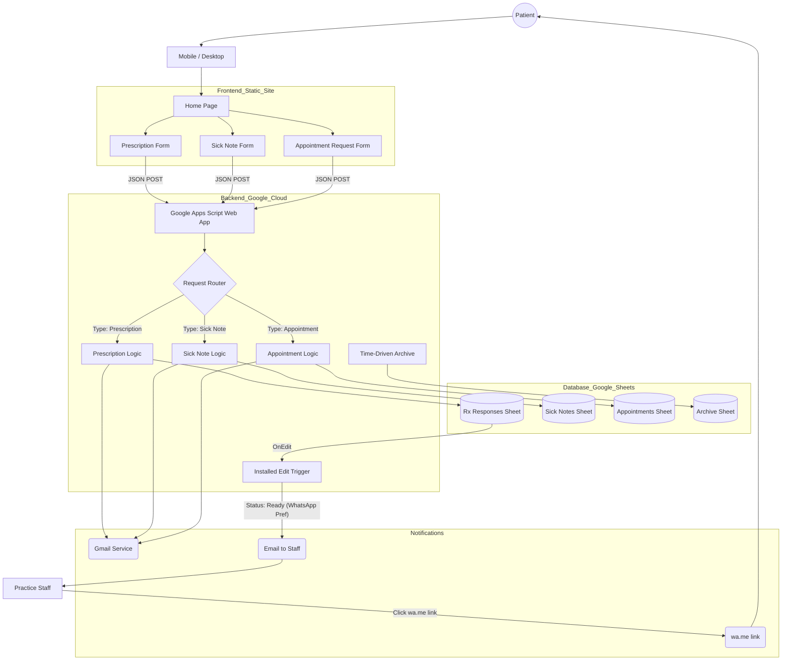

# Example Health Centre - Digital Transformation Proposal

## 1. Executive Summary

We propose a comprehensive digital transformation of the Example Health Centre's online presence. This solution replaces the legacy system with a modern, responsive, and secure web platform designed to streamline patient requests, reduce administrative overhead, and facilitate GDPR compliance workflows.

By leveraging a serverless architecture (Google Apps Script) combined with high-performance static hosting, we deliver a cost-effective, low-maintenance solution that integrates directly with your existing workflows (Google Sheets).

## 2. Solution Overview

### The Product
A 14-page bespoke website featuring interactive patient portals for prescription ordering and sick note certification.

### Value Proposition
*   **Efficiency:** Automates the sorting and processing of hundreds of weekly requests.
*   **Accessibility:** Fully responsive design ensures patients can access services from any device (Mobile, Tablet, Desktop).
*   **Control:** Primary records remain in the existing Google Workspace environment.
*   **Cost:** "One-time build" architecture with negligible ongoing hosting costs.

## 3. Key Features

### 💊 Smart Prescription Ordering
*   **Interactive Form:** Users can add multiple medications to a "digital cart" before submitting.
*   **Validation:** Built-in checks ensure all required patient details (DOB, Phone, Pharmacy) are captured.
*   **Intelligent Routing:** Submissions are automatically routed to a central "Form Responses" sheet, timestamped and status-tracked.
*   **Notification System:** Automated email confirmations to patients and staff-assisted WhatsApp notification for "Ready for Collection" alerts.

### 📝 Digital Sick Notes
*   **E-Signature:** Integrated signature pad allows patients to sign requests digitally on their phone.
*   **Secure Workflow:** Requests are routed to a dedicated "Sick Notes" secure sheet.
*   **Triage:** Auto-response emails inform patients of the 48-hour processing window and payment details.

### 🛡️ Compliance & Security
*   **Zero Tolerance & Confidentiality:** Dedicated pages clearly outlining practice policies.
*   **Data Protection & Privacy:** Form payloads transmit directly over HTTPS to the publicly accessible web-app submission endpoint, bypassing static web hosting, where persistence and record management occur within access-controlled Google Workspace/Drive storage. Hosting or CDN access logs and analytics may process online identifiers such as IP addresses, which are included in the overall data-processing assessment. Patient notification pathways encompass direct patient email confirmations and staff‑initiated wa.me URL‑based notification channel (third‑party) for alerts.
*   **Input Sanitization & Validation:** Anonymous submissions are permitted without caller authentication. Frontend inputs are validated for required fields, phone numbers, and email formatting prior to submission, while backend handlers enforce comprehensive payload validation, cell sanitization to prevent formula injection, rate limiting, honeypot spam detection, and context-specific HTML entity encoding for outgoing email notifications. *Note: Submissions use standard CORS requests with frontend JSON-result verification; request mode provides no authentication, while validation and sanitization are enforced by backend handlers.*
*   **Security & Compliance Review Required:** Prior to production deployment, a formal security and compliance assessment must be conducted covering data retention schedules, access control and role-based permissions, patient data deletion procedures, audit logging, and incident response controls for data stored in Google Sheets or transmitted via automated emails.

## 4. Technical Specifications & Statistics

| Metric | Value | Description |
| :--- | :--- | :--- |
| **Total Pages** | 14 | Including specific portals for Appointments, Prescriptions, and Policies. |
| **Frontend Code** | ~3,500 Lines | Semantic HTML5 for accessibility and SEO. |
| **Styling (CSS)** | ~1,275 Lines | Custom "Example Town Deep Green" theme with fluid responsiveness. |
| **Backend Logic** | 633 Lines | Google Apps Script handling routing, emails, and cleaning. |
| **Performance Target** | < 1.0s | Target Initial Load Time for static assets under 4G/broadband conditions (subject to client network and CDN caching). |
| **Uptime Target (Static Site / CDN)** | 99.9% | Static-site / CDN availability target for frontend portals (e.g., GitHub Pages / Netlify). |
| **End-to-End Forms Availability Target** | 99.5% | End-to-end form processing availability accounting for Google Apps Script execution quotas, backend dependencies, and service maintenance. |

## 5. Architectural Drawings

The system utilizes a **Serverless Headless Architecture**. The frontend is decoupled from the backend, communicating via HTTPS POST requests.

```mermaid
graph TD
    User((Patient))
    Device[Mobile / Desktop]
    Staff[Practice Staff]

    subgraph Frontend_Static_Site
        Home[Home Page]
        RxForm[Prescription Form]
        SickForm[Sick Note Form]
        ApptForm[Appointment Request Form]
    end

    subgraph Backend_Google_Cloud
        GAS[Google Apps Script Web App]
        Router{Request Router}
        RxLogic[Prescription Logic]
        SickLogic[Sick Note Logic]
        ApptLogic[Appointment Logic]
        Trigger[Time-Driven Archive]
        EditTrigger[Installed Edit Trigger]
    end

    subgraph Database_Google_Sheets
        Sheet1[(Rx Responses Sheet)]
        Sheet2[(Sick Notes Sheet)]
        Sheet3[(Appointments Sheet)]
        Archive[(Archive Sheet)]
    end

    subgraph Notifications
        Email(Gmail Service)
        StaffEmail(Email to Staff)
        WA(wa.me link)
    end

    User --> Device
    Device --> Home
    Home --> RxForm
    Home --> SickForm
    Home --> ApptForm

    RxForm -- JSON POST --> GAS
    SickForm -- JSON POST --> GAS
    ApptForm -- JSON POST --> GAS

    GAS --> Router
    Router -- "Type: Prescription" --> RxLogic
    Router -- "Type: Sick Note" --> SickLogic
    Router -- "Type: Appointment" --> ApptLogic

    RxLogic --> Sheet1
    SickLogic --> Sheet2
    ApptLogic --> Sheet3

    RxLogic --> Email
    SickLogic --> Email
    ApptLogic --> Email

    Sheet1 -- "OnEdit" --> EditTrigger
    EditTrigger -- "Status: Ready (WhatsApp Pref)" --> StaffEmail
    StaffEmail --> Staff
    Staff -- "Click wa.me link" --> WA
    WA --> User
    Trigger --> Archive
```

## 6. Visuals & Screenshots

### Figure 1: The Modern Dashboard (Home)
*(Description of `index.html`)*
A clean, welcoming landing page featuring quick-access buttons for "Order Prescription" and "Book Appointment". The "Example Town Deep Green" branding builds trust, while the "Zero Tolerance" banner ensures expectations are set immediately.

### Figure 2: The Smart Prescription Portal
*(Description of `order-prescription.html`)*
A dynamic interface where patients add medications row-by-row.
*   **Top Section:** Patient details (Name, Address, PPSN).
*   **Middle Section:** "Add Medication" button which opens a modal to prevent clutter.
*   **Bottom Section:** Pharmacy selection and a large "Confirm & Submit" button.
*   *Note: On mobile, this transforms into an accordion view for ease of use.*

### Figure 3: Digital Sick Note Certification
*(Description of `sick-notes.html`)*
Designed for touchscreens, this page features a large canvas area where patients sign with their finger. It collects dates, condition details, and "Return to Work" status in a single, fluid motion.

## 7. Conclusion

This proposal represents a significant upgrade to the practice's operations. By automating the intake of the two most common administrative tasks—prescriptions and certs—we free up valuable reception phone lines for clinical emergencies.

**Status:** Development & Demo Stage — Pending formal pre-deployment security and compliance review (data retention, access controls, deletion procedures, and audit logging) prior to production release.
